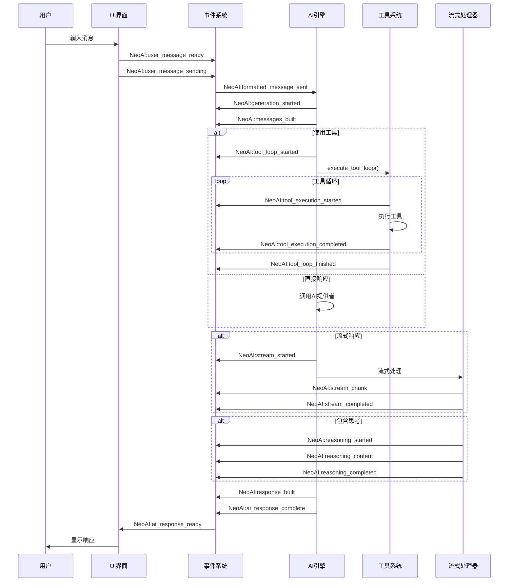

# AI 响应流程规范

本文档详细描述了 NeoAI 插件中 AI 响应生成的完整流程，遵循 `styleGuide.md` 中的架构设计规范。

## 整体架构

```
用户界面 (UI) → 事件系统 → AI 引擎 → 工具系统 → 响应构建 → 事件系统 → 用户界面
```

## 详细流程

### 1. 用户输入阶段

**触发点**: 用户在聊天窗口输入消息并发送

**流程**:
1. `ui/components/input_handler.lua` 接收用户输入
2. 调用 `chat_handlers.handle_enter()` 或 `handle_ctrl_s()`
3. 触发 `NeoAI:user_message_ready` 事件
4. 触发 `NeoAI:user_message_sending` 事件

**相关文件**:
- `ui/components/input_handler.lua`
- `ui/handlers/chat_handlers.lua`

### 2. 消息格式化阶段

**触发点**: 用户消息准备发送到 AI 引擎

**流程**:
1. `chat_handlers` 调用 `session_helper.format_user_message()`
2. 构建包含上下文的消息格式
3. 触发 `NeoAI:formatted_message_sent` 事件
   - 数据: `{original_content, formatted_content, session_id, window_id, timestamp}`

**相关文件**:
- `utils/session_helper.lua`
- `core/ai/response_builder.lua`

### 3. AI 引擎启动阶段

**触发点**: `NeoAI:formatted_message_sent` 事件被监听

**流程**:
1. `core/ai/ai_engine.lua` 的 `_setup_event_listeners()` 监听事件
2. 调用 `generate_response()` 函数
3. 触发 `NeoAI:generation_started` 事件
   - 数据: `{generation_id, formatted_messages}`

**相关文件**:
- `core/ai/ai_engine.lua`

### 4. 消息构建阶段

**触发点**: AI 引擎开始处理消息

**流程**:
1. `response_builder.build_messages()` 构建完整消息列表
2. 包含系统提示、历史消息和当前查询
3. 触发 `NeoAI:messages_built` 事件
   - 数据: `{messages, history_count}`

**相关文件**:
- `core/ai/response_builder.lua`

### 5. 工具调用决策阶段

**触发点**: AI 引擎检查是否需要工具调用

**流程**:
1. 检查 `options.use_tools` 配置
2. 检查是否有可用工具 (`#state.tools > 0`)
3. 如果启用工具，进入工具调用循环

**相关文件**:
- `core/ai/ai_engine.lua`

### 6. 工具调用循环阶段 (如果启用)

**触发点**: 启用工具调用

**流程**:
1. 触发 `NeoAI:tool_loop_started` 事件
   - 数据: `{current_messages}`
2. 调用 `tool_orchestrator.execute_tool_loop()`
3. 循环执行:
   - 调用 AI 生成响应
   - 解析工具调用 (`parse_tool_call()`)
   - 执行工具 (`execute_tool()`)
   - 构建工具响应消息
   - 检查是否继续 (`should_continue()`)
4. 触发 `NeoAI:tool_loop_finished` 事件
   - 数据: `{final_result, iteration_count}`

**相关文件**:
- `core/ai/tool_orchestrator.lua`
- `tools/tool_executor.lua`

### 7. 单个工具执行阶段

**对于每个工具调用**:
1. 触发 `NeoAI:tool_execution_started` 事件
   - 数据: `{tool_call}` 或 `{tool_name, args, start_time}`
2. 执行工具函数
3. 触发 `NeoAI:tool_execution_completed` 事件
   - 数据: `{tool_call, formatted_result}` 或 `{tool_name, args, result, duration}`
4. 如果执行失败，触发 `NeoAI:tool_execution_error` 事件

### 8. AI 直接响应阶段 (如果不使用工具)

**触发点**: 不启用工具调用或工具循环结束

**流程**:
1. 调用 `ai_provider.send_request()` (非流式) 或 `send_stream_request()` (流式)
2. 处理 AI 响应

**相关文件**:
- `core/ai/ai_provider.lua`

### 9. 流式处理阶段 (如果使用流式)

**触发点**: 使用流式响应

**流程**:
1. 触发 `NeoAI:stream_started` 事件
   - 数据: `{generation_id, formatted_messages}`
2. 注册流式处理器 (`stream_processor.process_chunk()`)
3. 处理每个数据块:
   - 解析思考内容 (`handle_reasoning()`)
   - 解析普通内容 (`handle_content()`)
   - 解析工具调用 (`handle_tool_call()`)
4. 触发 `NeoAI:stream_chunk` 事件
   - 数据: `{generation_id, cleaned_chunk}`
5. 触发 `NeoAI:stream_completed` 事件
   - 数据: `{session_id}`

**相关文件**:
- `core/ai/stream_processor.lua`

### 10. 思考过程处理阶段 (如果包含思考)

**触发点**: 接收到思考内容

**流程**:
1. 触发 `NeoAI:reasoning_started` 事件
2. 调用 `reasoning_manager.start_reasoning()`
3. 流式更新思考内容 (`append_reasoning()`)
4. 触发 `NeoAI:reasoning_content` 事件
   - 数据: `{reasoning_content}`
5. 思考结束时触发 `NeoAI:reasoning_completed` 事件

**相关文件**:
- `core/ai/reasoning_manager.lua`
- `ui/components/reasoning_display.lua`

### 11. 响应构建阶段

**触发点**: AI 响应完成

**流程**:
1. 调用 `response_builder.build_response()`
2. 整合原始消息、AI 响应和工具结果
3. 触发 `NeoAI:response_built` 事件

**相关文件**:
- `core/ai/response_builder.lua`

### 12. 响应完成阶段

**触发点**: 最终响应构建完成

**流程**:
1. 触发 `NeoAI:ai_response_complete` 事件
   - 数据: `{generation_id, response, messages}`
2. 清理生成状态
3. 通知 UI 更新显示

### 13. UI 更新阶段

**触发点**: UI 监听响应完成事件

**流程**:
1. `chat_window` 监听 `NeoAI:ai_response_complete` 事件
2. 调用 `render_messages()` 更新显示
3. 触发 `NeoAI:ai_response_ready` 事件

**相关文件**:
- `ui/window/chat_window.lua`

## 事件流程图



## 关键配置项

### AI 引擎配置
```lua
require("NeoAI").setup({
  ai = {
    model = "gpt-4",                    -- AI模型
    api_key = os.getenv("OPENAI_API_KEY"), -- API密钥
    max_tokens = 4096,                  -- 最大token数
    temperature = 0.7,                  -- 温度参数
    use_tools = true,                   -- 是否启用工具调用
    max_tool_iterations = 10,           -- 最大工具调用迭代次数
  },
})
```

### 工具配置
```lua
-- 注册工具
local tools = {
  {
    name = "search_web",
    func = function(query) 
      -- 搜索网页
      return "搜索结果: " .. query
    end,
    description = "搜索网页内容",
    parameters = {
      type = "object",
      properties = {
        query = {
          type = "string",
          description = "搜索关键词"
        }
      }
    }
  }
}

-- 设置工具
local ai_engine = require("NeoAI.core.ai.ai_engine")
ai_engine.set_tools(tools)
```

## 错误处理流程

### 1. AI 请求失败
- 触发 `NeoAI:generation_error` 事件
- 返回备用响应
- 记录错误日志

### 2. 工具执行失败
- 触发 `NeoAI:tool_execution_error` 事件
- 继续工具循环或终止
- 记录错误日志

### 3. 流式处理错误
- 触发 `NeoAI:stream_error` 事件
- 终止流式处理
- 记录错误日志

## 性能优化建议

### 1. 消息压缩
- 使用 `response_builder.compact_context()` 压缩长上下文
- 设置合理的 `max_history` 限制

### 2. 缓存策略
- 缓存工具调用结果
- 复用会话上下文

### 3. 异步处理
- 使用 `vim.schedule()` 避免阻塞UI
- 流式响应实时更新

## 调试和监控

### 事件调试
```lua
-- 监听所有 NeoAI 事件
vim.api.nvim_create_autocmd("User", {
  pattern = "NeoAI:*",
  callback = function(args)
    print("事件触发:", args.match, "数据:", vim.inspect(args.data))
  end
})
```

### 状态监控
```lua
local ai_engine = require("NeoAI.core.ai.ai_engine")
local status = ai_engine.get_status()
print(vim.inspect(status))
```

## 扩展点

### 1. 自定义工具
- 在 `tools/builtin/` 目录添加新工具
- 通过 `tool_registry.register()` 注册

### 2. 自定义事件处理器
- 监听特定事件实现自定义逻辑
- 使用事件系统实现插件扩展

### 3. 自定义响应格式
- 扩展 `response_builder` 模块
- 实现自定义响应构建逻辑

## 相关文档

- [架构设计](../styleGuide.md)
- [事件系统](./EVENTS.md)
- [工具系统](./TOOLS.md)
- [UI 设计](./UI_DESIGN.md)
```

这个文档详细描述了 AI 响应流程的每个阶段，符合 styleGuide.md 的规范。