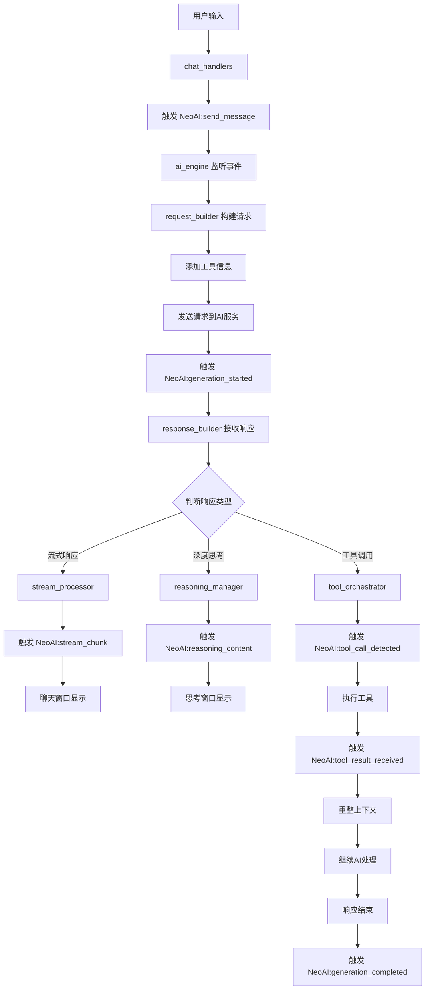

# 架构设计

NeoAI/
├── init.lua # 主入口文件
├── default_config.lua # 全局配置验证
├── core/ # 核心业务逻辑
│ ├── init.lua # 核心模块入口
│ ├── config/ # 配置管理
│ │ ├── keymap_manager.lua # 键位配置管理器
│ │ └── # 注意：config_manager.lua 已移除，使用 default_config.lua 替代
│ │ └── keymap_manager.lua # 键位配置管理器（新增）
│ ├── session/ # 会话管理
│ │ ├── session_manager.lua # 会话管理器
│ │ ├── branch_manager.lua # 分支管理
│ │ ├── message_manager.lua # 消息管理（合并操作）
│ │ └── data_operations.lua # 数据操作
│ ├── ai/ # AI交互（重新设计）
│ │ ├── ai_engine.lua # AI引擎主入口（接收聊天事件）
│ │ ├── request_builder.lua # 请求构建器（添加工具信息，格式化AI请求）
│ │ ├── response_builder.lua # 响应构建器（异步处理响应）
│ │ ├── stream_processor.lua # 流式处理器（处理流式响应）
│ │ ├── reasoning_manager.lua # 思考过程管理
│ │ └── tool_orchestrator.lua # 工具调用编排器
│ └── events/ # 事件系统
│ └── event_bus.lua # 事件总线（简化）
├── ui/ # 用户界面
│ ├── init.lua # UI模块入口
│ ├── window/ # 窗口管理
│ │ ├── window_manager.lua # 窗口管理器
│ │ ├── window_mode_manager.lua # 窗口模式管理器（新增）
│ │ ├── chat_window.lua # 聊天窗口
│ │ └── tree_window.lua # 树状图窗口
│ ├── components/ # UI组件
│ │ ├── input_handler.lua # 输入处理器
│ │ ├── history_tree.lua # 历史树组件
│ │ └── reasoning_display.lua # 思考过程显示
│ └── handlers/ # 事件处理器
│ ├── tree_handlers.lua # 树界面处理器
│ └── chat_handlers.lua # 聊天界面处理器
├── tools/ # 工具系统（新增）
│ ├── init.lua # 工具模块入口
│ ├── tool_registry.lua # 工具注册表
│ ├── tool_executor.lua # 工具执行器
│ ├── tool_validator.lua # 工具验证器
│ └── builtin/ # 内置工具
│ └── file_tools.lua # 文件工具
└── utils/ # 工具库（精简）
├── init.lua # 工具模块入口
├── common.lua # 常用工具函数
├── text_utils.lua # 文本处理
├── table_utils.lua # 表操作
├── file_utils.lua # 文件操作
└── logger.lua # 日志

# 关键流程说明

## 1. 启动流程

1. 用户调用 `setup(config)` → `default_config.validate_config()`
2. 初始化核心模块 → 初始化UI模块（传递窗口模式配置） → 初始化工具系统
3. 返回包含 `open()` 函数的表

窗口模式配置示例：

```lua
require("NeoAI").setup({
  ui = {
    default_ui = "chat",           -- 默认打开聊天界面
    window_mode = "split",          -- 使用分割窗口模式
    window = {
      width = 100,
      height = 30,
      border = "single",
    },
  },
  ai = {
    model = "gpt-4",
    api_key = os.getenv("OPENAI_API_KEY"),
  },
})
```

## 2. 树界面操作流程

`:NeoAIOpen` → `ui.open_tree_ui()`
回车键 → `tree_handlers.handle_enter()` → 关闭树界面 → 打开聊天界面
按键映射由 `tree_window.set_keymaps()` 设置

## 3. 聊天界面消息流程（重新设计）

用户输入 → `input_handler.handle_input()`
发送消息 → `chat_handlers.handle_enter()` 或 `handle_ctrl_s()`
触发事件 → `NeoAI:send_message`

## 4. AI处理流程（重新设计）

### 4.1 AI引擎接收事件

`ai_engine` 监听 `NeoAI:send_message` 事件 → 接收聊天消息

### 4.2 请求构建

`ai_engine` 调用 `request_builder.build_request()` → 添加工具信息 → 格式化请求体

### 4.3 发送请求

`ai_engine` 发送请求到AI服务 → 触发 `NeoAI:generation_started` 事件

### 4.4 响应处理

`response_builder` 异步接收响应 → 判断响应类型：

- 流式响应 → 交给 `stream_processor` 处理
- 深度思考 → 交给 `reasoning_manager` 处理
- 工具调用 → 交给 `tool_orchestrator` 处理

### 4.5 数据流处理

`stream_processor` 和 `response_builder` 通过事件系统发送解析的数据块：

- `NeoAI:stream_chunk` - 流式数据块
- `NeoAI:reasoning_content` - 思考内容
- `NeoAI:tool_call_detected` - 工具调用

### 4.6 响应结束

解析到响应结束标记 → `ai_engine` 触发 `NeoAI:generation_completed` 事件

## 5. 工具调用循环流程

模型返回工具调用 → `tool_orchestrator.execute_tool_loop()`
执行工具 → `tool_executor.execute()`
重整上下文 → `response_builder.build_context()`
继续调用模型直到结束

## 6. 思考过程显示流程

```
// 开始思考
data: {"choices":[{"delta":{"reasoning_content":"让我"}}]}
data: {"choices":[{"delta":{"reasoning_content":"一步步思考"}}]}

// ... 更多思考内容 ...

// 思考结束，开始输出答案
data: {"choices":[{"delta":{"content":"DeepSeek"}}]}
data: {"choices":[{"delta":{"content":"的思考过程"}}]}

// 流结束
data: {"choices":[{"delta":{},"finish_reason":"stop"}]}
```

接收到 `reasoning_content` → `reasoning_manager.start_reasoning()`
打开悬浮窗口 → `reasoning_display.show()`
流式更新 → `reasoning_display.append()`
思考结束 → `reasoning_display.close()` → 转换为折叠文本

## 7. 窗口模式配置流程

插件启动时 → `default_config` 读取默认窗口模式配置
用户自定义配置 → `ui.window_mode` 和 `ui.default_ui` 配置项
窗口管理器初始化 → `window_manager.initialize()` 接收窗口模式配置
创建窗口时 → `window_mode_manager.create_window_by_mode()` 根据模式创建窗口
支持三种模式：

- `float`: 浮动窗口（默认）
- `tab`: 新标签页
- `split`: 分割窗口

## 8. 键位配置流程

插件启动时 → `keymap_manager.load_default_keymaps()`
用户自定义配置 → `keymap_manager.set_keymap(context, action, key)`
窗口打开时 → `window.set_keymaps()` → 调用 `keymap_manager.get_keymap()`
保存配置 → `keymap_manager.save_keymaps()`
重置键位 → `keymap_manager.reset_keymap(context, action)`

## 9. 事件通信流程

模块A触发事件 → `vim.api.nvim_exec_autocmds("User", {pattern = "NeoAI:event_name", data = data})`
事件总线分发 → 模块B监听事件 → `vim.api.nvim_create_autocmd("User", {pattern = "NeoAI:event_name", callback = handler})`
执行回调函数 → 更新状态或触发新事件

## 10. AI模块详细交互流程



## 11. 模块职责说明

### ai_engine.lua

- 主入口，接收聊天事件信息
- 协调各个子模块工作
- 发送请求并触发开始事件
- 处理响应结束事件

### request_builder.lua（新增）

- 构建AI请求体
- 添加工具信息供模型选择
- 格式化消息为模型可接受的格式

### response_builder.lua

- 异步处理AI响应
- 判断响应类型（流式/思考/工具）
- 分发响应到对应处理器
- 构建工具调用上下文

### stream_processor.lua

- 处理流式响应数据
- 解析数据块
- 通过事件发送解析结果

### reasoning_manager.lua

- 管理深度思考过程
- 显示思考窗口
- 处理思考内容流

### tool_orchestrator.lua

- 编排工具调用循环
- 执行工具并收集结果
- 重整上下文继续AI处理

## 12. 事件依赖关系

- **启动事件链**：`NeoAI:session_created` → `NeoAI:branch_created` → `NeoAI:message_added`
- **AI处理链**：`NeoAI:generation_started` → `NeoAI:stream_started` → `NeoAI:stream_chunk` → `NeoAI:stream_completed`
- **工具调用链**：`NeoAI:tool_loop_started` → `NeoAI:tool_execution_started` → `NeoAI:tool_execution_completed` → `NeoAI:tool_loop_finished`
- **窗口管理链**：`NeoAI:WindowOpened` → `NeoAI:ChatBoxOpened` → `NeoAI:WindowClosed`

## 13. 数据流示例

```lua
-- 1. 用户发送消息
vim.api.nvim_exec_autocmds("User", {
  pattern = "NeoAI:send_message",
  data = {
    content = "帮我写一个Python函数",
    session_id = "session_123",
    window_id = "window_456"
  }
})

-- 2. AI引擎接收并处理
-- ai_engine 监听事件，调用 request_builder
local request = request_builder.build_request({
  messages = messages,
  tools = available_tools,
  model = "gpt-4"
})

-- 3. 发送请求并触发开始事件
vim.api.nvim_exec_autocmds("User", {
  pattern = "NeoAI:generation_started",
  data = {
    generation_id = "gen_789",
    request = request
  }
})

-- 4. 流式响应处理
-- response_builder 接收响应，判断为流式
-- stream_processor 处理数据块
vim.api.nvim_exec_autocmds("User", {
  pattern = "NeoAI:stream_chunk",
  data = {
    generation_id = "gen_789",
    chunk = "def hello_world():",
    is_final = false
  }
})

-- 5. 响应结束
vim.api.nvim_exec_autocmds("User", {
  pattern = "NeoAI:generation_completed",
  data = {
    generation_id = "gen_789",
    full_response = "def hello_world():\n    print('Hello World')"
  }
})
```

## 14. 配置项说明

### AI相关配置

```lua
ai = {
  model = "gpt-4",                    -- 使用的AI模型
  api_key = os.getenv("OPENAI_API_KEY"), -- API密钥
  temperature = 0.7,                   -- 温度参数
  max_tokens = 2000,                   -- 最大token数
  stream = true,                       -- 是否使用流式响应
  reasoning_enabled = true,            -- 是否启用深度思考
  tools_enabled = true,                -- 是否启用工具调用
  max_tool_iterations = 5,             -- 最大工具调用迭代次数
}
```

### 工具配置

```lua
tools = {
  -- 内置工具
  builtin = {
    file_read = true,                  -- 文件读取工具
    file_write = true,                 -- 文件写入工具
    search_files = true,               -- 文件搜索工具
  },
  -- 自定义工具
  custom = {
    {
      name = "calculator",            -- 工具名称
      description = "简单的计算器",     -- 工具描述
      parameters = {                   -- 参数定义
        expression = "string"
      },
      func = function(args)            -- 工具函数
        return load("return " .. args.expression)()
      end
    }
  }
}
```

## 15. 错误处理流程

1. **请求错误**：触发 `NeoAI:generation_error` 事件
2. **流式处理错误**：触发 `NeoAI:stream_error` 事件
3. **工具执行错误**：触发 `NeoAI:tool_error` 事件
4. **思考过程错误**：触发 `NeoAI:reasoning_error` 事件
5. **网络错误**：重试机制，最多重试3次

## 16. 性能优化建议

1. **请求缓存**：缓存相似的AI请求结果
2. **流式处理优化**：批量处理数据块，减少事件触发频率
3. **工具调用优化**：并行执行独立的工具调用
4. **内存管理**：及时清理不再使用的会话和消息数据
5. **事件去重**：避免重复触发相同的事件

## 17. 测试策略

1. **单元测试**：测试各个模块的独立功能
2. **集成测试**：测试模块间的交互和事件流
3. **端到端测试**：模拟用户完整的使用流程
4. **性能测试**：测试高并发下的系统表现
5. **错误恢复测试**：测试各种错误场景的恢复能力

## 18. 扩展性设计

1. **插件系统**：允许第三方扩展工具和处理器
2. **模型适配器**：支持不同的AI模型提供商
3. **自定义事件**：允许用户定义和使用自定义事件
4. **配置热重载**：支持运行时修改配置
5. **主题系统**：支持自定义UI主题
